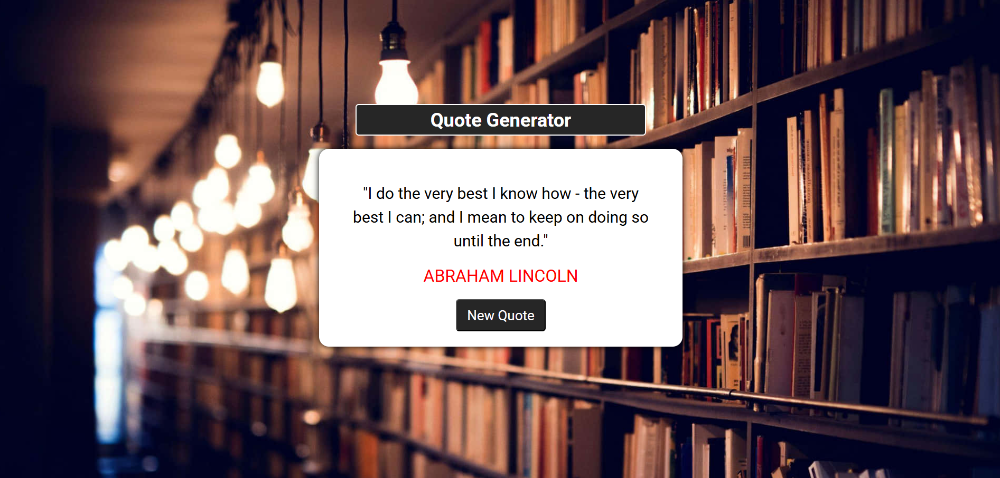

# 💬 Quote Generator

A clean, minimal web app that displays random inspirational quotes at the click of a button. Built with vanilla HTML, CSS, and JavaScript — no frameworks, no dependencies.



---

## 🚀 Live Demo

> Open `index.html` in your browser — no server required.

---

## ✨ Features

- 20 hand-picked inspirational quotes from historical figures and icons
- Displays a random quote and author name on every button click
- Fully responsive and centered layout
- Background image with a clean card-style UI
- Google Fonts (Roboto) + Font Awesome icons integrated
- Pure vanilla JavaScript — zero dependencies

---

## 🛠️ Tech Stack

| Technology       | Purpose                   |
| ---------------- | ------------------------- |
| HTML5            | Structure & markup        |
| CSS3             | Styling & layout          |
| JavaScript (ES6) | Quote randomization logic |
| Google Fonts     | Typography (Roboto)       |
| Font Awesome 7   | Icon library              |

---

## 📁 Project Structure

```
quote-generator/
├── index.html        # Main HTML file
├── style.css         # Stylesheet
├── app.js            # JavaScript logic
├── assets/
│   └── img1.jpg      # Background image
└── README.md         # Project documentation
```

---

## ⚙️ Getting Started

### 1. Clone the repository

```bash
git clone https://github.com/Rabia-1275/Quote-Gen.git
```

### 2. Navigate into the project folder

```bash
cd quote-generator
```

### 3. Open in browser

Simply open `index.html` in any modern browser:

```bash
# On macOS
open index.html

# On Linux
xdg-open index.html

# On Windows
start index.html
```

> No build tools, package managers, or servers needed.

---

## 👤 Author

**Rabia Naseer**
